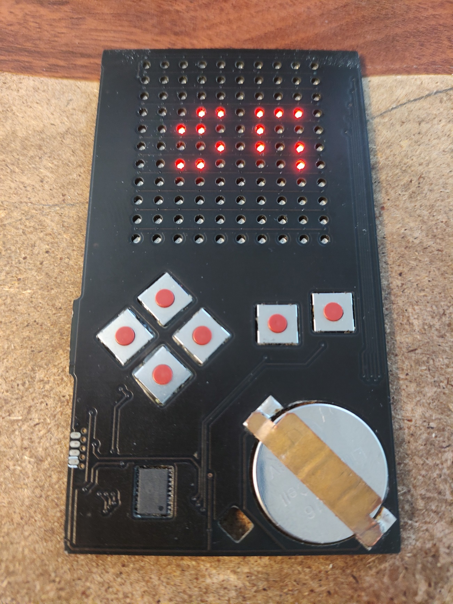
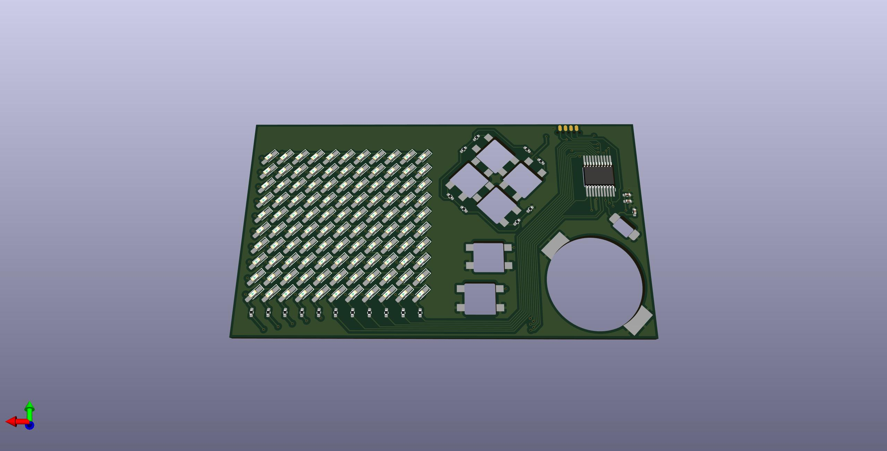
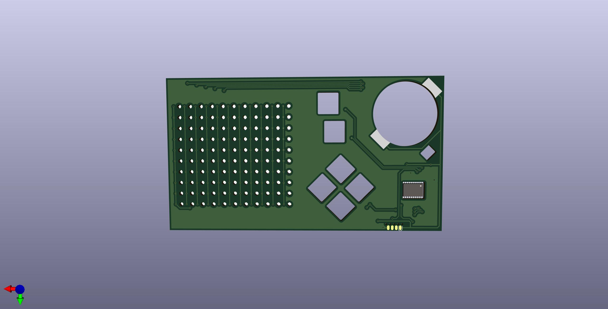

# PCB BUSINESS CARD

this project is a business card made of a circuit board with an 11x10 charlieplexed LED display.

The circuit board uses special construction techniques to achieve minimum thickness, such as mounting every component upside-down, through drilled holes.

this project is based on the HK32F030M microcontroller, which is obscure and poorly-documented (in english, at least), but very inexpensive

the total cost per card (purchased in medium-low volume) is ~$0.80CAD, which is high for a business card but still relatively cheap

# INCOMPLETE FIRMWARE

the firmware for this project is incomplete. the breakout game is unfinished, and I haven't even began working on pong, space invaders, and other games i wanted to add.

also, the font is a little unreadable on the display, which sort of defeats the purpose of this business card. I probably should have included my name and email in the silkscreen

---

still, uploading this for reference, perhaps someone can use this project as an example of how to set up keil for the hk32. that chip doesn't have much documentation, it seems everyone went for the risc-v based budget microcontrollers and not the ARM-based HK32 or PY32

# IMAGES

